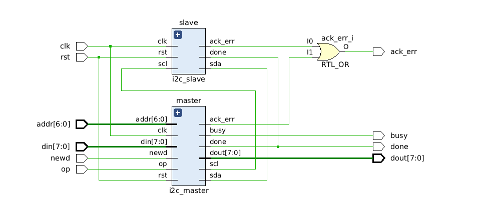

# I2C Controller — Verilog

An I2C controller implemented in SystemVerilog, supporting configurable clock control, TX/RX logic.

---

## Schematic

---

## Transmission Protocol

I2C data packets are arranged in 8-bit bytes comprising a slave address and transfer data. Each transmission is either a read or write operation, built from a series of sub-protocols: start/stop conditions, address byte, data bits, and ACK/NACK bits.

---

## Clock Control

The master controls SCL throughout the transfer. For each bit, the master pulls SCL low and sets the data bit on SDA, then releases SCL high — this is when the data is sampled. Data is valid while SCL is high and transitions while SCL is low.

---

## Start & Stop Conditions

### Start condition

Initiated by the master at the beginning of every transmission to wake idle slaves on the bus. SDA transitions from HIGH to LOW while SCL is HIGH — one of only two permitted SDA changes during a high SCL.

### Stop condition

Generated by the master at the end of a transfer. SDA transitions from LOW to HIGH while SCL is HIGH, signalling slaves to return to idle and release the bus.

---

## Address Byte

Transmitted as an 8-bit byte, MSB first. The final bit indicates the direction of the transaction: read or write.

---

## ACK / NACK

After every byte, the receiver sends one feedback bit. An ACK is signalled by holding SDA low during a high SCL period. A NACK is signalled by leaving SDA passively pulled high — the receiver does not respond.

---

## Data Bits

Transmitted in 8-bit bytes, MSB first. Each bit is synchronised with SCL — the bit is set while SCL is low and sampled on the rising edge.
